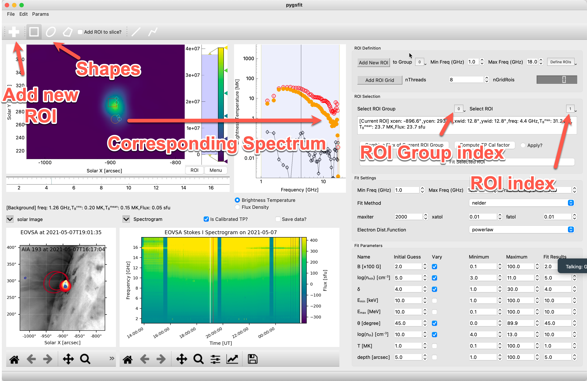

==============
pyGsfit Usage
==============

Input
=====
Required input: EOVSA fits cube(s), multiple selection is supported.

Optional input: SDO/AIA image fits file, EOVSA dynamic spectrum fits file.

Region of Interest (ROI)
=========================

First up, pick the shape you like. Then, hit the '+' button to pop a new ROI onto your screen. You can move it around, make it bigger or smaller,
or even give it a spin. Feel free to add as many as you need. To pick one, just click on it or use the ROI index and group index to find it quickly.
The spectrum correspond to the selected ROI is presented as the solid circles on the right

   Adding, selecting ROI.

Once you have selected the desired ROI/Spectrum for analysis, proceed to the spectrum panel. There, you will find the frequency mask. Please click and drag this mask to delineate the frequency range you want to fit. Additionally, you can convert the spectrum from its default representation of brightness temperature to a flux density spectrum.

Fit
===

Learn more about fit `Method
<https://lmfit.github.io/lmfit-py/fitting.html>`_.

Learn more about `electron_energy_distribution_function
<https://github.com/kuznetsov-radio/gyrosynchrotron/blob/master/doc/AnalyticalDistributions.pdf>`_.

.. raw:: html

   <embed src="https://github.com/kuznetsov-radio/gyrosynchrotron/blob/master/doc/AnalyticalDistributions.pdf" type="application/pdf" width="700" height="500">

